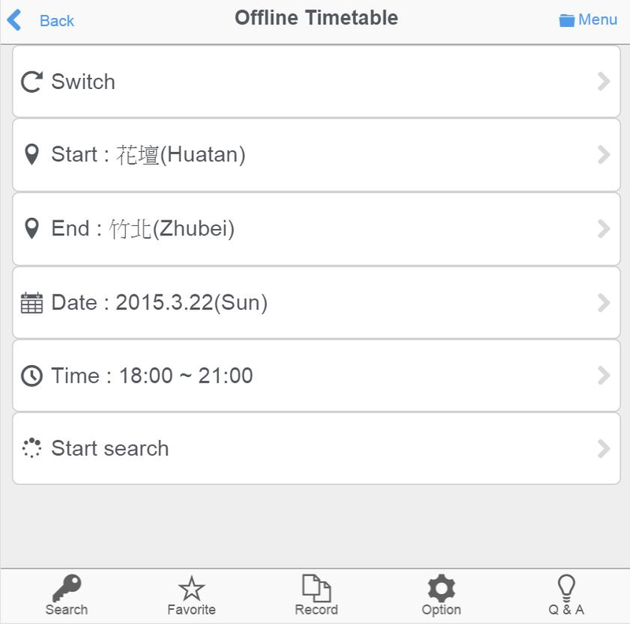

# OfflineTimetable

* 自動轉乘的離線時刻表，以台鐵車站為主，高鐵、國光和統聯為輔。
* An offline timetable for TRA, THSR, UBUS and KingBus in Taiwan

## Demo

* https://googledrive.com/host/0ByZ1Jl6ghzUBbkNhVFNMbUhZcU0

## External Library

* App Framework 2.0
* https://github.com/01org/appframework

## License

* Apache License, Version 2.0
* http://www.apache.org/licenses/LICENSE-2.0

